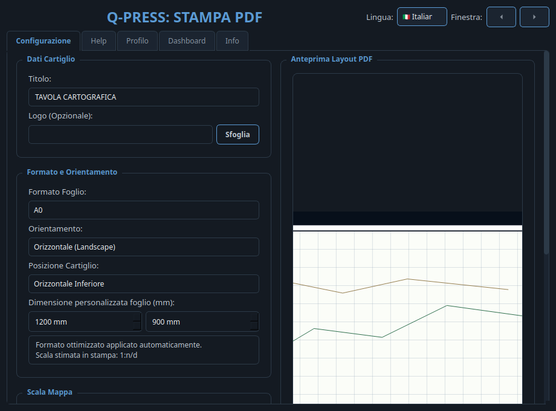
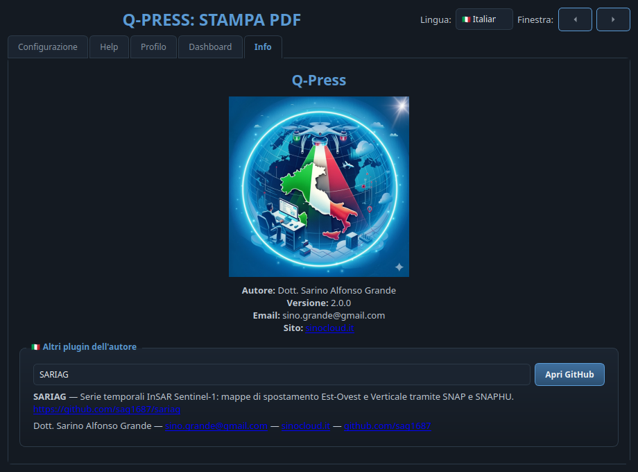

# 🖨️ Q-Press

**🌐 Lingua / Language:** [🇮🇹 Italiano](#italiano) · [🇬🇧 English](#english)

## 📸 Screenshot

| Scheda Configurazione / Configuration tab | Scheda Info con menù a tendina / Info tab with drop-down |
|---|---|
|  |  |

> **IT** · A sinistra la configurazione di stampa (formato, cartiglio, scala); a destra la scheda Info con il menù a tendina degli altri plugin dell'autore. · **EN** · On the left the print setup (format, title block, scale); on the right the Info tab with the drop-down of the author's other plugins.

## Italiano

Q-Press e' un plugin QGIS per generare una tavola cartografica PDF partendo da una selezione diretta sul canvas. L'utente usa `Shift + Drag` per definire l'area della mappa, configura formato, cartiglio, attributi, dashboard e profilo topografico, quindi esporta un solo PDF multipagina.

### Funzionalita

- Selezione area mappa con `Shift + Drag`.
- Secondo `Shift + Drag` direzionale quando e' attivo il profilo topografico.
- Formato ottimizzato automaticamente tra A4, A3 e A0.
- Formato foglio personalizzato con larghezza e altezza in millimetri.
- Scala mappa automatica oppure manuale con denominatore `1:x`.
- Orientamento orizzontale o verticale.
- Cartiglio laterale o inferiore con struttura tecnica a celle.
- Anteprima proporzionata al layout reale, con render dei layer quando disponibile.
- Scala grafica, indicatore della scala applicata, freccia nord, griglia coordinate, legenda proporzionata e mappa di inquadramento.
- Tabella attributi filtrata sulle sole geometrie realmente presenti nell'area selezionata.
- Dashboard con grafici a torta, barre e percentuali, con testi adattivi nelle aree disponibili.
- Profilo topografico su singola linea: OpenTopoData online oppure raster DTM/DEM gia' caricato nel progetto.
- Grafica profilo con griglia, progressiva, quote, testi adattivi e picchetti.
- Monitor quota OpenTopoData nella scheda `Profilo`: stato ultimo noto, richieste inviate in sessione e stima delle richieste necessarie.
- Cartiglio adattivo professionale: mappa di inquadramento contestuale, badge scala applicata, dati tavola tabellari, sezioni incorniciate e, quando entra interamente, estratto attributi nel cartiglio.
- Preparazione del profilo in background con barra di avanzamento; composizione ed export layout restano nel thread principale QGIS.
- Scheda `Help` integrata con guida rapida e note su scala e formati.
- Interfaccia selezionabile in italiano o inglese.
- Freccette nella barra superiore per ridurre o aumentare la finestra del plugin quando QGIS rende scomodo il ridimensionamento manuale.
- Output in un solo PDF finale; le immagini tecniche temporanee vengono gestite fuori dalla cartella di output.

### Uso Rapido

1. Selezionare il layer di riferimento, vettoriale o raster.
2. Cliccare `Q-Press: Area to PDF`.
3. Usare `Shift + Drag` per disegnare l'area della mappa.
4. Configurare lingua, formato, scala, cartiglio, contenuti, dashboard e profilo.
5. Se il profilo topografico e' attivo, dopo la conferma eseguire un secondo `Shift + Drag` lungo la direzione del profilo.
6. Premere `Genera PDF`.

### Schede

- `Configurazione`: titolo, logo, lingua, formato, dimensioni personalizzate, scala, orientamento, cartiglio, contenuto e cartella di output. La scheda scorre quando la finestra viene ridotta.
- `Help`: guida rapida all'uso, con chiarimenti su scala automatica/manuale e formato personalizzato.
- `Profilo`: attiva il profilo topografico, sceglie la sorgente quote e definisce il titolo da campo, titolo manuale o titolo unico. Il profilo finale usa solo la linea intercettata dal secondo tracciamento, non tutte le geometrie nel riquadro.
- `Dashboard`: seleziona campi categoria, campo valore, aggregazione, tipo grafico, etichette, percentuali, ordinamento e destinazione.
- `Info`: autore, logo e collegamenti agli altri plugin.

### Output

Q-Press produce un solo file:

- `qpress_<layer>_<data>.pdf`

Il PDF puo contenere:

- tavola cartografica principale;
- pagina attributi;
- pagine dashboard;
- pagine profilo topografico.

### Sorgenti Altimetriche

- `OpenTopoData online`: usa `https://api.opentopodata.org/v1/eudem25m,srtm30m,aster30m,mapzen` con interpolazione bilineare. Serve connessione internet.
- `Genera Profilo da progetto`: campiona la banda 1 del raster DTM/DEM selezionato tra i layer raster gia' presenti nel progetto QGIS.

### Tema grafico e scheda Info

Dalla versione 2.0.0 Q-Press adotta il tema scuro **"slate blue"** condiviso da tutta la famiglia di plugin
SinoCloud (lo stesso di SARIAG e STAC Browser). Il selettore lingua in alto mostra le bandiere 🇮🇹/🇬🇧 e nella
scheda **Info** un **menù a tendina** elenca gli altri plugin dell'autore: selezionandone uno compaiono la
descrizione bilingue e il pulsante per aprire il repository GitHub corrispondente.

### Autore

Dott. Sarino Alfonso Grande
- ✉️ Email: [sino.grande@gmail.com](mailto:sino.grande@gmail.com)
- 🌐 Sito ufficiale: [sinocloud.it](https://sinocloud.it)
- 🐙 GitHub: [sag1687](https://github.com/sag1687)

## English

Q-Press is a QGIS plugin that generates a cartographic PDF sheet from a direct canvas selection. The user uses `Shift + Drag` to define the map area, configures paper size, title block, attributes, dashboards and topographic profile, then exports one multipage PDF.

### Features

- Map area selection with `Shift + Drag`.
- Second directional `Shift + Drag` when the topographic profile is enabled.
- Automatically optimized paper size among A4, A3 and A0.
- Custom paper size with width and height in millimeters.
- Automatic or manual map scale with `1:x` denominator.
- Landscape or portrait orientation.
- Right-side or bottom title block with a technical cell-based structure.
- Preview proportional to the real layout, with live layer rendering when available.
- Graphic scale, applied-scale indicator, north arrow, coordinate grid, proportioned legend and overview map.
- Attribute table filtered to the features actually present inside the selected area.
- Dashboard with pie, bar and percentage charts, with text fitted to the available areas.
- Single-line topographic profile from online OpenTopoData or a DTM/DEM raster already loaded in the project.
- Profile graphics with grid, chainage, elevations, fitted labels and stakes.
- OpenTopoData quota monitor in the `Profile` tab: last known status, requests sent in session and estimated requests needed.
- Professional adaptive title block: contextual overview map, applied-scale badge, tabular sheet data, framed sections and, when it fully fits, an attribute excerpt in the title block.
- Background profile preparation with a progress bar; layout composition and export remain on the QGIS main thread.
- Integrated `Help` tab with quick guidance and notes about scale and paper sizes.
- Interface switchable between Italian and English.
- Top-bar arrows to decrease or increase the plugin window when QGIS makes manual resizing awkward.
- Output as one final PDF; temporary technical images are handled outside the output folder.

### Quick Use

1. Select the reference layer, vector or raster.
2. Click `Q-Press: Area to PDF`.
3. Use `Shift + Drag` to draw the map area.
4. Configure language, paper size, scale, title block, content, dashboard and profile.
5. If the topographic profile is enabled, after confirming perform a second `Shift + Drag` along the profile direction.
6. Click `Generate PDF`.

### Tabs

- `Configuration`: title, logo, language, paper size, custom dimensions, scale, orientation, title block, content and output folder. The tab scrolls when the window is reduced.
- `Help`: quick usage guide with notes about automatic/manual scale and custom paper size.
- `Profile`: enables the topographic profile, selects the elevation source and defines the title from a field, manual title or single title. The final profile uses only the line intercepted by the second trace, not every feature in the box.
- `Dashboard`: selects category fields, value field, aggregation, chart type, labels, percentages, sorting and placement.
- `Info`: author, logo and links to related plugins.

### Output

Q-Press produces one file only:

- `qpress_<layer>_<date>.pdf`

The PDF can contain:

- main cartographic sheet;
- attribute page;
- dashboard pages;
- topographic profile pages.

### Elevation Sources

- `Online OpenTopoData`: uses `https://api.opentopodata.org/v1/eudem25m,srtm30m,aster30m,mapzen` with bilinear interpolation. Internet access is required.
- `Generate Profile from project`: samples band 1 of the selected DTM/DEM raster among raster layers already present in the QGIS project.

### Theme and Info tab

Since version 2.0.0 Q-Press adopts the **"slate blue"** dark theme shared by the whole SinoCloud plugin family
(the same as SARIAG and STAC Browser). The language selector at the top shows the 🇮🇹/🇬🇧 flags, and the **Info**
tab hosts a **drop-down menu** listing the author's other plugins: selecting one shows the bilingual description
and a button opening the corresponding GitHub repository.

### Author

Dott. Sarino Alfonso Grande
- ✉️ Email: [sino.grande@gmail.com](mailto:sino.grande@gmail.com)
- 🌐 Official website: [sinocloud.it](https://sinocloud.it)
- 🐙 GitHub: [sag1687](https://github.com/sag1687)

### Altri plugin dell'autore / Other plugins by the author

| Plugin | Repository |
|---|---|
| **SARIAG** | [github.com/sag1687/sariag](https://github.com/sag1687/sariag) |
| **STAC Browser** | [github.com/sag1687/stac_browser](https://github.com/sag1687/stac_browser) |
| **GeoBridge** | [github.com/sag1687/geobridge](https://github.com/sag1687/geobridge) |
| **Quick CRS Fixer** | [github.com/sag1687/CRS_FIXER](https://github.com/sag1687/CRS_FIXER) |
| **GeoCSV Mapper** | [github.com/sag1687/GeoCSV-Mapper](https://github.com/sag1687/GeoCSV-Mapper) |
| **QGIS Ledger** | [github.com/sag1687/qgis_ledger](https://github.com/sag1687/qgis_ledger) |
| **TAF Italia** | [github.com/sag1687/TAF_ITALIA_DOWNLOAD](https://github.com/sag1687/TAF_ITALIA_DOWNLOAD) |

## Versioning

From version `1.2`, every change must increment `version` in `metadata.txt`, add a `changelog.txt` entry and keep README/metadata aligned with the actual functionality.

## Main Files

- `q_press_plugin.py`: plugin entry point.
- `tools/map_tool.py`: `Shift + Drag` map/profile capture.
- `dialogs/settings_dialog.py`: configuration, help, profile, dashboard and info interface.
- `layout/layout_builder.py`: PDF layout construction.
- `layout/chart_generator.py`: dashboard chart rendering.
- `layout/topographic_profile.py`: OpenTopoData/project raster sampling and elevation profile rendering.
- `layout/pdf_exporter.py`: PDF export.
- `metadata.txt`: QGIS metadata.
- `changelog.txt`: version history.
