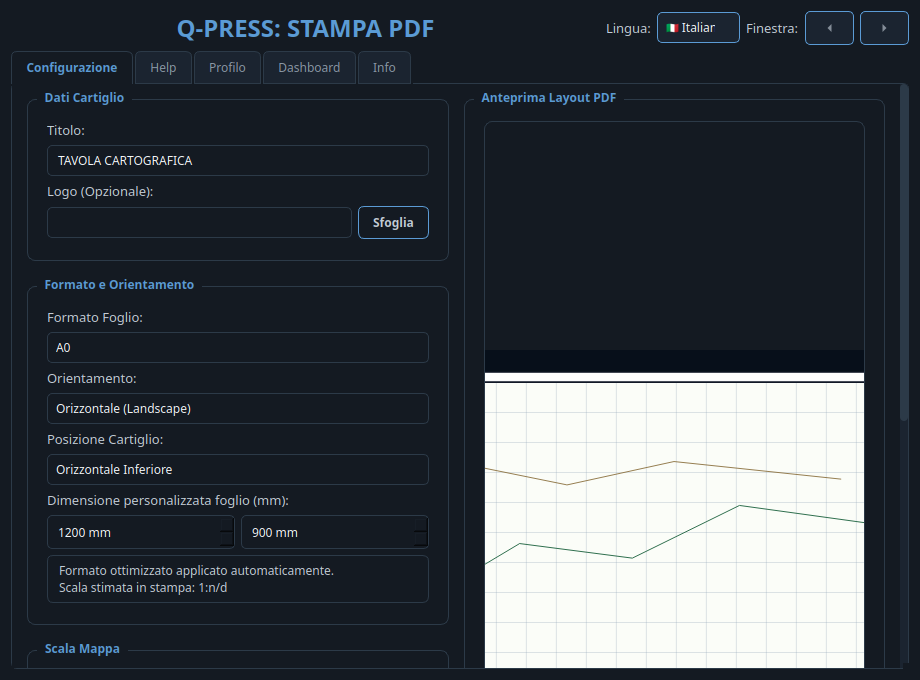
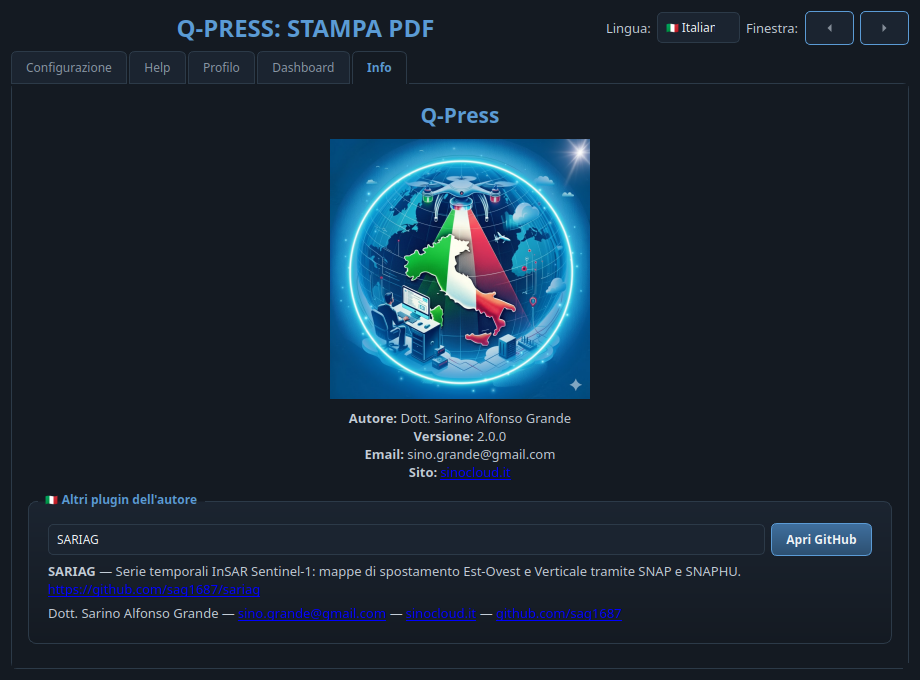

# Q-Press 

**IT: Genera PDF cartografici professionali dall'area selezionata sul canvas con Shift+trascina: scala, griglie, legenda, tabelle e profilo topografico. / EN: Generate professional cartographic PDFs from the canvas area selected with Shift+drag: scale, grids, legend, tables and topographic profile.**

---

## 📖 Informazioni / About

Q-Press allows you to select an area directly from the QGIS canvas using Shift+Drag and instantly generate a professional cartographic PDF. The output includes a technical title block, automatic or manual scale, custom paper size, coordinate grids, legend, overview map, filtered attribute tables, statistical dashboards, and a single-line topographic profile from OpenTopoData or a project DTM/DEM raster.

## 📸 Screenshot

  

  

## 📝 Changelog

### Version 2.0.4
Full security and Qt6 compatibility audit (network calls with timeout and https scheme whitelist, secure temp dirs, Qt5/Qt6 enum shims verified in every module); added the official supportsQt6 flag so QGIS Qt6 builds accept the plugin. / Audit completo di sicurezza e compatibilità Qt6 (chiamate di rete con timeout e whitelist schema https, directory temporanee sicure, shim enum Qt5/Qt6 verificati in ogni modulo); aggiunto il flag ufficiale supportsQt6 per le build QGIS Qt6.

---

Sviluppato da <b>Dott. Sarino Alfonso Grande</b> 
🌐 <a href="https://sinocloud.it">SinoCloud.it</a>

